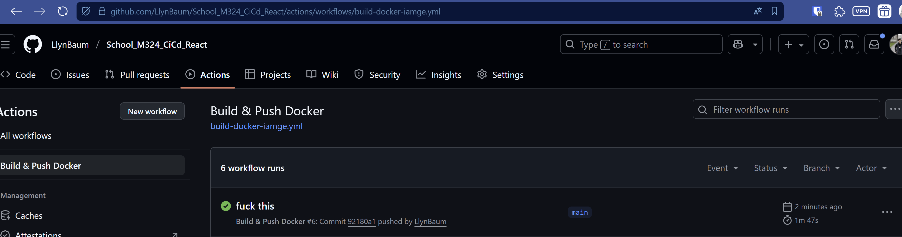
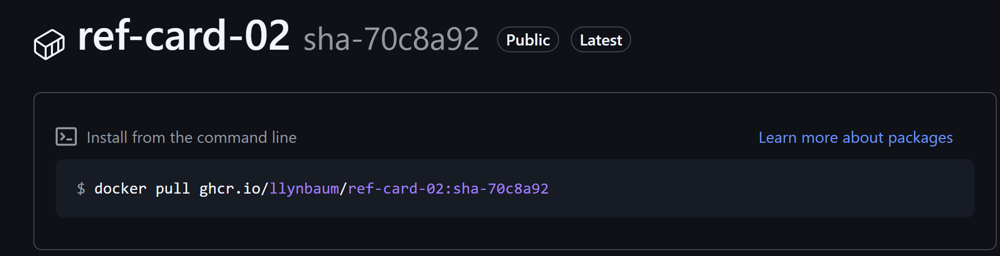
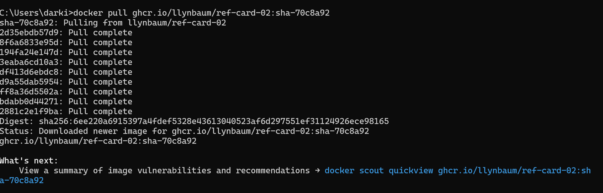
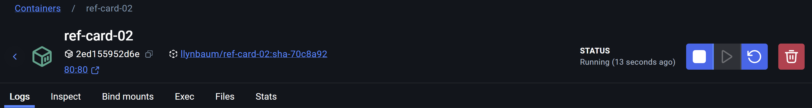
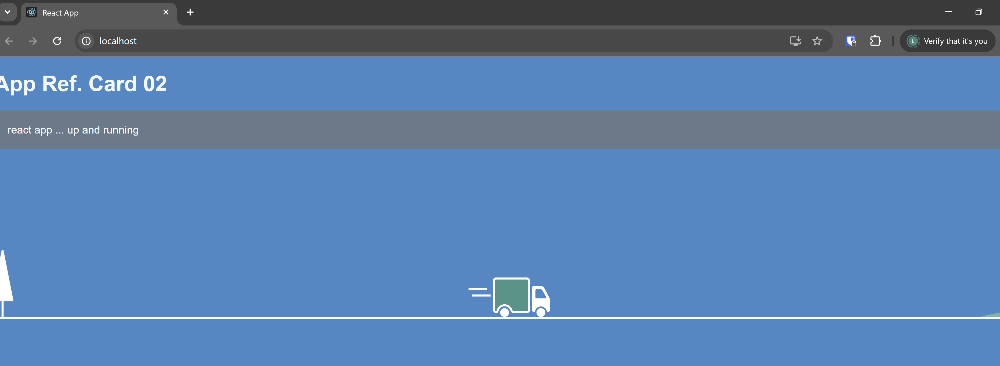

# Vorgehen

## Dockerfile erstellen

Multistage React Build mit Dockerfile. Vom alten Modul übernommen.

## GitHub Action erstellen

1. Checkout vom Repo
2. Node Aufsetzten um die Tests zu runnen (actions/setup-node@v4)
3. Run npm install command
4. Run npm test command um die Tests laufen zu lassen
4. In die GitHub Registry einloggen (docker/login-action@v3)
5. Docker metadata (docker/metadata-action@v5)
    - Image name festlegen
    - Registry auf `ghcr.io` setzten (im Image Name)
6. Build Docker Image und resultat zur Registry Pushen (docker/build-push-action@v6)
    - Das Dockerfile angeben, welches das React Project builded

Der Login Lauft hier über den GitHub Token von dem Repo, der per Default verfügbar ist. Muss also nichts eingerichtet werden.

Wen die Action gelaufen ist:

[GitHub Action Run](https://github.com/LlynBaum/School_M324_CiCd/actions/runs/18942254902/job/54083845402)

## Docker Hub

Ist soweit gleich wie Github, aber mann muss anstelle vom Login in die Github Registry sich auf Dockerhub einloggen.
Für das bracuht man den TOKEN für DockerHub. Der kann auf `https://app.docker.com/accounts/<user>/settings/personal-access-tokens` erstellt werden. 
Der Token muss im Repo unter Settings -> Security -> Secrets -> Actions als Secret hinterlegt werden.

Dan im yaml file, muss das Login nun `docker/login-action@v3` auf den DockerHub User mit dem Token gehen. Die Action die das Dockerfile builded und pushed bleibt gleich.

## Zusatz

Ich habe aus 2 verschiedenen Actions für DockerHub und GHCR eine einzelne Action gemacht. 
Das Ziel: das Ract Porjekt muss nur einmal gebuilded werden.
Wie es geht:
1. Builden von React Project
2. Run Tests
3. Build Dockerfile
4. Zip Dockerfile und upload als artifact
5. In Github und DockerHub push jobs
    1. Download Artefact
    2. Metadaten für Image ready machen
    3. docker push

# Resultat

Das Image auf der GitHub Registry:

Das Image auf der Dockerhub Registry:

Image local pullen:

Container Running:

Website:
